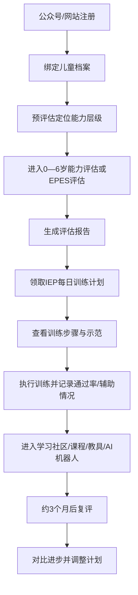
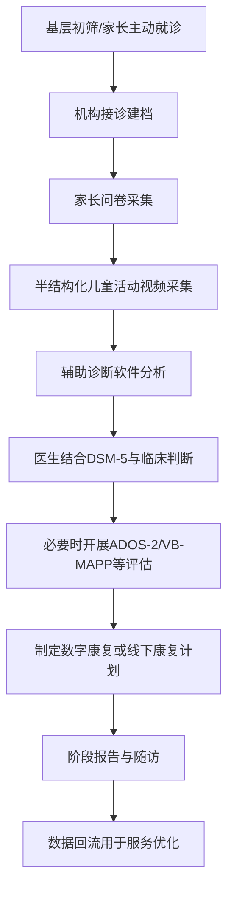
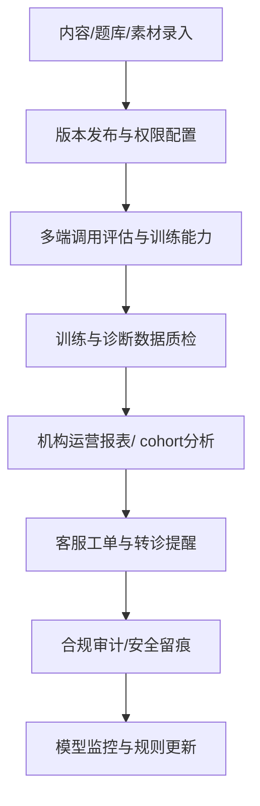
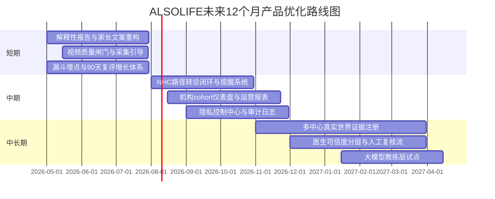

# ALSOLIFE 产品经理视角分析报告

## 执行摘要

ALSOLIFE已经从一个“家长可免费使用的0—6岁能力评估+IEP计划平台”，逐步进化为覆盖居家评估、数字康复、辅助诊断、线下中心与诊所协同的产品矩阵：官方资料显示，公司创立于2017年2月，当前公开产品至少包括免费0—6岁评估与IEP、面向学龄衔接的EPES融合评估、2岁以上儿童可用的AI个训机器人/认知数字康复方案，以及与entity["organization","北京大学第六医院","beijing psychiatric hospital"]合作研发的ASD筛查与辅助诊断软件；其中，公开页面披露该辅助诊断软件已取得医疗器械注册证，且在当前阶段临床研究中达到90%的准确率、93.1%的灵敏度和85.7%的特异度。与此同时，ALSOLIFE在产品化和商业化上最强的优势，不是单点算法，而是“筛查/评估—计划生成—训练执行—数据回流—机构落地”的闭环能力；但它的关键短板也同样明显：C端留存、付费转化、B端客单价、训练数据规模与标注方法、模型更新治理、儿童视频隐私细则等核心经营与合规信息仍大面积未公开。从产品经理视角看，这是一家**方向正确、证据开始成形、但还没有把“证据透明度”和“规模化交付能力”完全做成护城河**的公司；未来12个月最值得投入的，不是再堆新功能，而是把解释性报告、转诊闭环、真实世界证据、儿童数据合规和机构端运营仪表盘做深做透。citeturn6view2turn16view0turn14view1turn16view1turn12view0turn22view1turn18view2

## 公司与产品概览

ALSOLIFE的公开定位并不是单一App，而是“面向孤独症与儿童神经发育障碍”的平台型产品：一端是家长可直接使用的免费评估、IEP、内容社区和教具/课程体系，另一端是机构和医生可使用的数字康复与辅助诊断工具，中间再用线下中心、诊所和科研合作把数据与服务串起来。官方介绍还显示，平台以ALSO理念与ABA理论为基础，强调从儿童当前训练反推其未来生活独立所需能力，这决定了它的产品逻辑更接近“长期能力经营系统”，而不仅仅是一次性筛查工具。citeturn16view0turn14view0turn16view1

| 维度 | 结论 | 证据 |
|---|---|---|
| 成立时间 | 2017年2月 | 官方联系页、公司介绍均写明创立于2017年2月。citeturn6view2turn16view0 |
| 公司主体 | 北京阿叟阿巴科技有限公司 | 官方联系页披露。citeturn6view2 |
| 团队规模 | **未公开**；公开招聘页仅披露干预师学历结构；第三方工商聚合口径显示2024年社保人数约46人，但这不等于全员规模 | 招聘页写明ALSO·IN在职干预师中本科及以上占比超过95%；启信宝搜索摘要显示2024年社保人数46人。citeturn14view5turn17search10 |
| 团队结构 | 公开口径显示研发科技人员占比近61%；公开报道称约三分之一员工为自闭症家长 | 健康界文章、极客公园报道。citeturn18view2turn18view3 |
| 产品矩阵 | 免费0—6岁评估与IEP、EPES融合评估、AI个训机器人/认知数字康复、ASD筛查与辅助诊断软件、ALSO课堂、教具商城、ALSO·IN/ALPHA线下机构与诊所 | 官方系统介绍、手册、AI机器人页、诊所诊断页、商城与招聘页。citeturn14view0turn14view1turn12view0turn22view1turn14view3turn14view4turn14view5 |
| 目标用户 | C端：ASD/发育迟缓儿童家长与儿童；B端：儿童保健科、儿童康复科、发育行为科、精神科、康复机构、特教学校；线下：需要诊断/干预/融合支持的家庭 | 官方页面与解决方案介绍。citeturn12view0turn18view2turn16view1turn14view5 |
| 商业模式 | 公开可见为“免费评估获客 + 课程/教具/培训付费 + AI数字康复产品 + 线下中心/诊所服务 + 医院/机构端软件合作 + 政府/项目制场景” | 免费评估与IEP、课程收费、教具商城、AI机器人销售上线、医院与海南项目落地。citeturn14view1turn14view3turn14view4turn9view0turn21search23turn18view2 |
| C端定价/付费路径 | 0—6岁评估与IEP：免费；“渔计划”599元/人，实操考试99元/次；教具单品约119—288元；AI个训机器人价格：**未公开**；“金手册”价格：**未公开** | 官方手册、ALSO课堂、商城与AI机器人页。citeturn14view1turn14view3turn14view4turn12view0 |
| B端定价 | **未公开** | 公开页面未披露医院/机构部署价格。citeturn18view2turn22view1 |
| 线下覆盖 | 招聘页显示开放城市包括郑州、西安、天津、成都、南京、太原、合肥、石家庄、济南、海口；官方大事记显示2024年海口中心为第11家ALSO·IN中心 | 招聘页与大事记。citeturn14view5turn9view0 |

从产品组合看，ALSOLIFE最像“层层递进的漏斗”：先用免费评估与内容建立信任，再把用户导向IEP执行、学习社区、课程与教具；对更高需求用户，再承接到AI个训机器人、线下中心或诊所；对医院与机构，则输出辅助诊断与数字康复系统。这种设计本质上兼顾了C端流量入口、B端临床入口和线下真实世界数据入口。citeturn14view1turn14view3turn12view0turn22view1turn18view2turn18view3

## 功能模块与用户流程

从公开资料拆解，ALSOLIFE已经不是“单点量表工具”，而是一个多角色协作系统。下面的模块化视图，C端和B端主要依据官方页面整理；“运营/管理后台”部分因为官方未开源展示，只能基于其公开服务能力、教师端数据录入方式和医院级产品的最低必需能力做合理反推，已明确标注。citeturn14view0turn14view1turn16view1turn12view0turn22view1turn18view3

| 角色 | 公开关键功能 | 典型交互目标 | 产品经理观察 |
|---|---|---|---|
| C端家长/儿童 | 注册、绑定儿童、预评估、0—6岁能力评估、EPES评估、评估报告、发展年龄/同龄排名、IEP每日推送、训练步骤查看、通过率与辅助情况记录、复评、学习社区、课程、教具、AI个训机器人 | 尽快知道“孩子现在在哪、下一步练什么、练了有没有进步” | 高价值入口是“免费评估→个性化计划→持续执行”；真正决定留存的不是评估本身，而是IEP可执行性和复评反馈闭环。citeturn14view0turn14view1turn16view1turn12view0 |
| B端机构/医生 | 家长问卷采集、半结构化视频采集、ASD辅助诊断分析、ADOS-2/VB-MAPP等评估服务、数字康复方案实施、阶段报告、科室/机构应用 | 提高筛查效率、辅助诊断一致性、扩展可服务病例数、把康复过程数据化 | B端价值点不是“替代医生”，而是“提高前处理效率 + 标准化部分判断 + 形成康复随访数据资产”。citeturn22view1turn18view2 |
| 运营/管理后台 | **以下多为合理反推**：题库/训练素材管理、版本发布、账号与权限、设备管理、内容审核、数据质检、机构报表、模型监控、合规审计、客服工单、转诊提醒 | 支撑多端产品一致交付、监管留痕和机构规模化复制 | 对一家同时做免费C端、医院软件、数字康复和线下中心的公司来说，后台不只是运营系统，更是“证据、合规和交付”的控制中枢。公开资料未展示后台细节，这是当前信息透明度短板。citeturn18view3turn18view2turn8view3 |

### C端家长/儿童典型路径

这条路径的关键公开节点包括“预评估—正式评估—报告—IEP每日推送—训练记录—三个月复评”，其中IEP与复评构成了持续使用的核心循环。citeturn14view0turn14view1

### B端机构/医生典型路径

这里最值得注意的是，公开资料把软件定位为**医生辅助工具**而不是独立诊断替代品，这对监管边界和责任边界都非常关键。citeturn22view1turn22view2

### 运营/管理后台典型路径

该流程是基于公开可见的训练数据回流、教师端数据录入、机构应用和信息安全认证能力反推出来的最小后台框架；官方并未公布具体后台页面，因此应视为产品结构判断，而非官方功能清单。citeturn18view3turn18view2turn8view3

## 核心技术与数据来源

ALSOLIFE在公开资料里最清晰的技术主线有三层。第一层是理论基础：平台明确写明以ALSO理念和ABA为基础来构建评估与干预系统。第二层是诊断/康复依据：辅助诊断软件公开写明基于DSM-5开发；能力评估公开研究则与VB-MAPP、PEP-3做了效标关联。第三层才是算法实现：官方和媒体材料提到多模态融合机器学习框架，以及以多通道LSTM-RNN进行人脸与人体行为识别的公开描述。换句话说，ALSOLIFE并不是“先有模型、再找场景”，而是“先有临床/教育框架、再做数字化实现”。citeturn16view0turn6view5turn5search11turn20search3

| 主题 | 公开可核验信息 | PM判断 |
|---|---|---|
| 理论基础 | 官方系统介绍写明以“应用行为分析（ABA）”为基础；官方公司介绍写明平台基于ALSO理念搭建。citeturn6view1turn16view0 | 这是内容结构化与计划自动生成的根。对PM而言，内容树和里程碑体系比单个模型更重要。 |
| 诊断依据 | 辅助诊断软件公开页写明基于DSM-5规定的ASD诊断标准研发，采集家长问卷和半结构化儿童活动视频，为1—6岁疑似ASD儿童提供辅助诊断依据。citeturn22view1 | 说明它当前是“临床辅助决策系统”，不是完全黑盒的消费级自测工具。 |
| 公开算法框架 | 启动研发报道披露：系统基于多通道LSTM-RNN对图像、音视频中的人脸和人体行为进行检测、识别、比对和分析，再基于多模态融合机器学习框架建模训练。citeturn5search11turn6view5 | 算法描述已经足够说明其方向，但还不足以支撑外界评估模型稳健性；特征工程、标注协议、漂移治理均未公开。 |
| 能力评估内容 | 官方系统页称：六大能力领域、27个能力区域、500+技能点，覆盖1—7岁普通发育儿童关键行为；评估后生成阶数、得分、同龄排名和发展年龄，并支持每日推送教学计划。citeturn14view0turn16view0 | 这更像“数字化课程规划引擎”而非单纯量表。 |
| 学术验证 | 2021年论文显示，ALSOLIFE caregiver-assessed system 与VB-MAPP、PEP-3在总分、六大技能域、22个因子层面存在良好效标相关；企业材料称该研究覆盖1050名国内ASD儿童。citeturn20search3turn5search14turn6view4 | 这是其最重要的学术资产之一，但它验证的是“能力评估有效性”，不是“诊断软件有效性”。 |
| 诊断软件临床表现 | 官方诊所页面披露：当前阶段临床研究纳入519名1—6岁儿童，准确率90%，AUC 94.6%，灵敏度93.1%，特异度85.7%，阳性预测率90%，阴性预测率90%。citeturn22view1 | 这组数值很有竞争力，但仍应视为“官方阶段性结果”，仍然需要更多论文、外部复现和多中心前瞻性验证。 |
| 数字康复内容资产 | AI个训机器人页面披露：174项里程碑技能、2000+干预目标、80000种训练素材；适用于2岁以上且认知发育月龄小于72个月的儿童。citeturn12view0 | 内容资产规模已经达到“平台级”水平，这也是其可持续迭代的重要壁垒。 |
| 数据资产 | 企业自述：线上已服务超37万孤独症家庭，线下积累超9千万条康复数据。较早公开报道则称2022年已有32万用户，线下系统每天生成30万条以上数据。citeturn18view2turn18view3 | 这些是强信号，但属于企业/媒体口径，未见审计披露。用于判断成长趋势有价值，用于估值时需打折。 |
| 安全与合规 | 官方大事记写明获得等保三级备案、信息安全管理体系和ISO9001/14001/45001等认证。citeturn8view3 | 从国内政企合作角度，这是医院和政府项目推进的必要门槛。 |
| 未公开部分 | 训练数据规模、病例/对照分布的完整细节、标注流程、标注者资格、一致性控制、模型更新频率、删除策略、脱敏策略、联邦/本地推理架构均未公开。 | 这些正是下一阶段决定外部信任和规模化采购的关键。 |

一个需要特别说清的点是：**公开资料并没有证明ALSOLIFE的辅助诊断算法直接“按ADOS/ADI-R条目重建”**。公开能核验的关系是三条：其一，诊断软件以DSM-5为明确开发依据；其二，ALPHA诊所同时提供ADOS-2与VB-MAPP评估服务；其三，能力评估研究与VB-MAPP、PEP-3存在效标相关。因此，在产品表述上，更稳妥的说法应是“以DSM-5和多模态行为数据为基础的辅助诊断工具”，而不是“数字版ADOS/ADI-R”。citeturn22view1turn20search2turn20search3

从数据安全角度看，ALSOLIFE已经公开展示了医院和政企合作常见的“资质层合规”能力——等保三级、信息安全管理体系、ISO系列认证；但对儿童视频和问卷这类高敏感数据而言，用户最关心的通常不是“有没有认证”，而是“采集多久、谁能看、能否撤回、训练后如何删除、模型更新时是否二次使用”。这些细则在公开页面上仍未见充分披露。citeturn8view3turn22view1

## 用户体验与关键指标

用户体验上，ALSOLIFE最大的亮点是把“评估结果”翻译成“今天就能执行的训练任务”，把传统线下康复里最贵、最不稳定的“计划制定”和“训练标准化”尽量前置到系统里。官方手册和系统介绍都显示，家长可以直接拿到IEP，每日推送训练项目，训练项目还有详细步骤与示范；这比很多只给风险分数、不告诉下一步怎么做的筛查工具更贴近家庭实际需求。citeturn14view0turn14view1

但从指标透明度看，ALSOLIFE目前更像“强产品、弱披露”。公开资料能看到一些里程碑数字，却很难看到标准SaaS/数字健康经营指标，比如评估完成率、D30留存、90天复评率、首单转化率、续费率、机构上线周期、科室活跃率、医生采纳率等。以下表格把“已公开指标”和“未公开关键指标”分开列示。citeturn16view0turn18view2turn18view3turn22view1turn21search23

| 指标类别 | 公开情况 | 证据 |
|---|---|---|
| 累计服务家庭数 | 2020年官方称“累计服务自闭症家庭数量超过15万”；2024年企业口径为线上服务超37万家庭 | citeturn8view0turn18view2 |
| 平台用户规模 | 2022年媒体报道系统已有32万用户 | citeturn18view3 |
| 数据沉淀 | 2022年媒体称线下系统每天生成30万条以上数据；2024年企业口径为线下积累超9千万条康复数据 | citeturn18view3turn18view2 |
| 评估系统有效性 | 学术论文支持其与VB-MAPP、PEP-3的良好效标相关 | citeturn20search3turn5search14 |
| 辅助诊断准确性 | 当前阶段临床研究：准确率90%，AUC 94.6%，灵敏度93.1%，特异度85.7% | citeturn22view1 |
| 公共项目实际使用量 | 海南2023年累计为900余名患儿提供数字疗法干预，累计训练时长达百万分钟；2024年项目目标为不少于1000名儿童、至少三个月、每月15次服务 | citeturn21search6turn21search23 |
| 留存率 | **未公开** | 公开资料未见披露。citeturn18view2turn16view0 |
| C端付费转化率 | **未公开** | 公开资料未见披露。citeturn14view3turn14view4 |
| 续费率 | 公开仅见单点媒体口径：2023年4月海南有超过40%家庭一次性续费6个月；官方未系统披露 | citeturn21search12 |
| NPS/家长满意度 | **未公开** | 公开资料未见披露。citeturn16view0turn18view2 |
| 医生采纳率 / 报告采信率 | **未公开** | 公开资料未见披露。citeturn22view1 |

基于ALSOLIFE公开产品路径——免费评估、IEP每日推送、约三个月复评，以及海南项目“至少3个月、每月15次”的交付节奏——下面给出更适合作为内部北极星和二级指标的建议值。需要强调：**下表均为建议目标，不是ALSOLIFE已公开真实经营数据。**citeturn14view0turn14view1turn21search23

| 建议KPI | 建议定义 | 12个月建议目标 | 假设前提 |
|---|---|---|---|
| 建档完成率 | 注册用户中完成儿童档案建立的比例 | ≥75% | 入口以公众号/网站为主，注册流程已较成熟 |
| 评估完成率 | 建档用户中完成首次正式评估的比例 | ≥60% | 评估项较长，需要优化中途流失 |
| IEP激活率 | 完成评估后7日内至少打开3次训练计划的比例 | ≥65% | 免费报告本身不足以留存，计划激活更关键 |
| D30训练留存 | 首月内至少完成8次训练记录的用户占比 | ≥35% | 面向高负担家庭，这一数值不宜设得脱离现实 |
| 90天复评率 | 到达复评周期并完成二次评估的比例 | ≥25% | 官方已设三个月复评节奏 |
| 家长周活跃家庭数 | 每周至少一次查看计划/记录训练/看阶段报告的家庭数 | 建议设为核心北极星 | 比MAU更能反映康复执行 |
| B端机构上线周期 | 从签约到首例可用的平均天数 | ≤45天 | 医院IT/伦理/培训流程较长 |
| 医生报告采纳率 | 辅助诊断报告被医生纳入病历或结论参考的比例 | ≥70% | 需把报告解释性和证据链做强 |
| 训练依从性 | 建议训练任务中被实际执行完成的比例 | ≥50% | 比“打开”更接近疗效 |
| 数据质检通过率 | 上传视频/训练数据满足分析标准的比例 | ≥90% | 这是AI稳定性的前提 |

如果要在“用户体验”层面只抓三件事，我会建议抓：**评估完成率、IEP激活率、90天复评率**。前两者决定漏斗，后一者决定ALSOLIFE能否真正形成闭环和真实世界证据。对于B端，再加一个“医生采纳率”就足以判断辅助诊断软件是不是进入临床主流程，而不是只停留在展示层。  

## 商业与市场分析

ALSOLIFE所在市场并不是一个“需求教育市场”，而是一个“强需求、弱供给、强支付痛感、强监管约束”的市场。entity["organization","国家卫生健康委员会","china health ministry"]发布的《0～6岁儿童孤独症筛查干预服务规范（试行）》明确指出，我国儿童孤独症患病率约为7‰，且0—6岁应按11次节点开展初筛、复筛、转诊和干预；行业报告转述口径则估计，全国0—14岁孤独症儿童约200万、每年新增约16万。另一组更直接反映支付痛感的数据来自家庭调查：平均每个家庭直接干预成本约6950元/月，且有超过一半家庭出现一位家庭成员退出工作、全职照护的情况。citeturn22view2turn23view1turn19search11turn19search2turn18view3

| 市场层次 | 规模判断 | 含义 |
|---|---|---|
| 需求池 | 0—6岁患病率约7‰；0—14岁患儿约200万、每年新增约16万 | 说明这不是小众小病种，而是高公共卫生价值赛道。citeturn22view2turn23view1turn19search11 |
| 支付痛感 | 直接干预成本约6950元/月；个别家庭实际月支出可到1万—2万元量级 | “降本增效”不是营销口号，而是核心价值主张。citeturn19search2turn11search6turn11search14 |
| 政策机会 | NHC已把0—6岁儿童孤独症筛查干预纳入标准化服务；海南2024年启动免费数字疗法项目，目标覆盖不少于1000名儿童、至少3个月、每月15次服务 | 政府项目和妇幼体系是最重要的B2G/B2B2G突破口。citeturn22view2turn23view1turn21search23 |
| 机构机会 | 公开方案明确适用于儿童保健科、儿童康复科、发育行为科、精神科、康复机构和特教学校 | 适合“医院先落地，机构后扩张”的渠道策略。citeturn18view2 |

从竞品格局看，ALSOLIFE并不只是在跟“另一个自闭症App”竞争，它实际同时面对三类替代方案：一类是医械级的辅助诊断产品；一类是问卷式筛查工具；一类是消费级AI育儿入口。对于产品经理来说，真正有意义的不是“谁名字像竞品”，而是谁在抢同一段用户旅程和预算。citeturn22view1turn24search4turn24search26turn24search14

| 产品/类别 | 定位 | 年龄/对象 | 数据输入 | 医疗/监管属性 | 定价/付费 | 与ALSOLIFE关系 |
|---|---|---|---|---|---|---|
| ALSOLIFE | 能力评估 + IEP + 数字康复 + 辅助诊断 + 线下机构/诊所闭环 | 0—6岁评估；1—6岁辅助诊断；2岁以上认知月龄<72个月可用AI个训机器人 | 问卷、能力测试、训练记录、半结构化视频、多场景训练数据 | 官方页面披露ASD辅助诊断软件注册证号为湘械注准20222211071；2023年官方称认知能力数字康复软件为第二张注册证 | 免费评估；课程、教具、培训付费；B端定价未公开 | 基线产品本身。citeturn14view1turn12view0turn22view1turn9view0 |
| Canvas Dx（entity["company","Cognoa","autism digital health"]） | 医疗专业人员使用的处方型ASD诊断辅助 | 18—72个月、已存在发育迟缓风险的儿童 | 家长/照护者/医生输入与系统判读 | entity["organization","美国食品药品监督管理局","us drug regulator"]De Novo后形成“pediatric autism spectrum disorder diagnosis aid”类别，后续又有510(k)更新；明确不是独立诊断设备 | 公开页未披露价格 | **强直接竞品**：在“临床辅助诊断”层面可对照，但ALSOLIFE还多了康复和中国本土交付链。citeturn24search4turn24search12turn24search0 |
| M-CHAT-R/F | 免费量表式早筛工具 | 婴幼儿筛查 | 家长问卷 | 不是诊断工具；阳性儿童仍需进一步评估 | 免费下载 | **基础替代方案**：门槛最低、传播最广，但不能形成训练和康复闭环。citeturn24search26 |
| 海马爸比 | 消费级AI育儿/母婴看护入口 | 泛母婴家庭 | 看护设备、育儿内容、一般行为监测 | App Store页面明确声明不提供医疗建议，也不替代诊断或治疗 | 公开页面未披露完整价格体系 | **间接竞品**：争夺早期家长注意力和“先看一看AI能不能帮忙”的心智，但不是ASD专病工具。citeturn24search2turn24search14 |

真正让ALSOLIFE区别于这些替代方案的，是它把三件通常彼此分散的事连在了一起：**一是中国本土儿童能力评估；二是家庭侧可执行的数字康复；三是医生/机构侧可用的辅助诊断与线下服务承接。**这也是它最有机会形成壁垒的地方。citeturn16view0turn14view0turn22view1turn18view2

在变现路径上，ALSOLIFE当前更合理的拆解方式不是“C端订阅”一个维度，而是五层收入栈：第一层，免费评估获客；第二层，课程、培训和教具等低客单价增值；第三层，AI个训机器人/数字康复方案；第四层，线下诊所和中心服务；第五层，医院软件部署、政府项目和科研合作。海南免费项目也说明，数字疗法在这个领域并不一定只能靠家长自费，省级公共项目和妇幼体系采购同样可能成为主通路。citeturn14view1turn14view3turn14view4turn12view0turn21search23turn18view2

合作渠道方面，ALSOLIFE已经公开展示出比较完整的BD地图：与entity["organization","中国科学院心理研究所","beijing psychology institute"]、北京大学神经科学研究所、entity["organization","浙江大学","hangzhou university"]、北京语言大学等科研/高校合作；与entity["organization","海南省妇女儿童医学中心","haikou hainan china"]、北京大学第六医院等医疗机构合作；再加上ALSO·IN、ALPHA等线下交付网络。这种“科研+医院+政府项目+线下实证中心”的渠道拼图，对ToB医疗产品是加分项。citeturn8view0turn8view2turn8view3turn9view0

## 合规与伦理风险

ALSOLIFE最大的合规优势，是它没有把自己公开包装成“替代医生的一键诊断”。无论是ASD辅助诊断软件还是国际对标产品Canvas Dx，公开表述都强调“辅助诊断/adjunct to the diagnostic process”的定位；而我国NHC规范也要求基层初筛、妇幼复筛、专业机构进一步诊断和干预，说明监管思路明确倾向于“分层筛查+专业诊断+持续干预”，而不是把自闭症识别完全下放给消费级工具。citeturn22view1turn24search4turn22view2turn23view1

| 风险主题 | 当前公开状态 | 风险说明 | 建议缓释方式 |
|---|---|---|---|
| 医疗资质边界 | 公开页面显示ASD辅助诊断软件已有医疗器械注册证；认知能力数字康复软件为第二张注册证 | 好处是能进入更正式的医疗体系；风险是适应证、科室范围、跨场景传播都必须严格一致 | 所有面向家长的文案必须区分“辅助诊断”“评估”“康复训练”“非诊断内容”四层术语。citeturn22view1turn9view0 |
| 误诊/漏诊责任 | 官方已明确“为临床医生提供依据”；NHC路径也要求转诊到有诊断能力的机构 | 对高敏感病种来说，假阴性会延误干预，假阳性会制造家庭焦虑和无效支出 | 产品报告默认输出“风险+证据+下一步就医建议”，避免只给分数不给行动。citeturn22view1turn22view2turn23view1 |
| 儿童视频与生物特征数据伦理 | 公开能见到的是视频采集、问卷采集及等保/ISO认证；儿童视频留存、脱敏、撤回同意等细则未公开 | 1—6岁儿童视频属于高敏感数据，且可能涉及家庭环境、照护者语音与面部信息 | 增设家长可见的数据范围说明、删除入口、最短留存策略和用途分级授权。citeturn22view1turn8view3 |
| 数据集偏差与泛化 | 公开有519例当前阶段临床研究，也有大量平台数据口径，但病例地域、年龄层、合并症结构未完整公开 | 若样本来自特定城市/就诊人群，模型可能在基层、低资源地区或共病人群上表现下降 | 多中心前瞻性研究必须按年龄、性别、地域、语言水平、共病分层披露。citeturn22view1turn18view2 |
| 连续学习模型监管 | 公开资料未披露模型更新频率、再训练触发机制和回滚策略 | 数字疗法/辅助诊断一旦持续迭代，需防止“版本升级后性能漂移” | 建立版本冻结、灰度发布、A/B对照和性能回归审查。 |
| 儿童利益优先 | EPES公开明确把“儿童获利最大”作为安置原则 | 商业上容易把“更多训练”包装成“更好结果”，但对儿童并不一定最优 | 把“儿童获利最大、环境适配、负担可承受”写入所有建议逻辑。citeturn16view1 |
| 家长依赖与算法神化 | 平台报告详细、日更计划强，容易让家长把系统当作唯一判断依据 | 在重压场景下，家长更容易把“可量化”误认为“绝对正确” | 报告中增加“算法可见证据+人工判断必要性+不确定项提示”。 |
| 支付公平性 | 家庭干预成本高，且大量家庭退出劳动市场；数字疗法若只走自费高价路线，会强化不平等 | 该赛道天然带有公共卫生与残障支持属性 | 优先拓展政府项目、医保/商保探索、医院科室采购，而非过度依赖纯家庭自费。citeturn19search2turn18view3turn21search23 |

从伦理角度，ALSOLIFE不能只满足“有证”和“有模型”，还要满足“家长能理解、医生能追责、儿童能获益、数据能撤回”。这四件事里，前两件决定能不能进医院，后两件决定这家公司能不能长期被信任。  

## 产品改进建议、实施路线图与结论

### 产品改进建议

下面的建议按照短期、中期、长期排序，优先级基于三个判断：第一，当前公开优势已经证明ALSOLIFE有较强的内容和闭环基础；第二，最影响其上台阶的，是证据透明度和规模化交付，而不是功能数量；第三，这个赛道对“信任”比对“炫技”更敏感。

| 建议 | 优先级 | 时间 | 可行性 | 预估影响 |
|---|---|---|---|---|
| 把家长侧报告改造成“解释性报告” | 高 | 短期 | 高 | 直接提升家长理解度、医生接受度与投诉可控性；建议新增“证据片段、风险等级、为何建议转诊、建议时限”四块。 |
| 上线“视频质量闸门” | 高 | 短期 | 高 | 对辅助诊断软件尤为关键；如果采集质量差，后面所有准确率都不稳。建议在上传前自动检测光照、时长、儿童出镜比例、互动完整性。 |
| 构建与NHC路径对齐的转诊闭环 | 高 | 短期 | 中高 | 把“初筛—复筛—专业诊断—康复”链条做成产品化任务流，可显著增强政府/妇幼体系落地能力。 |
| 做“90天复评驱动”的增长体系 | 高 | 短期 | 高 | 目前公开节奏已是三个月复评；建议把全站增长从“下载/注册”改为“首次评估→IEP激活→90天复评完成”。 |
| 为机构端建设cohort运营仪表盘 | 高 | 中期 | 中高 | 让科室主任、机构负责人看到依从性、复评率、报告生成时效、病例结构、疗程完成率，是B端续约的关键。 |
| 建立真实世界证据注册与年度白皮书 | 高 | 中期 | 中 | 这会显著增强医院采信、政采竞争力与品牌可信度；建议每年至少发布一版方法透明的RWE报告。 |
| 引入家长隐私控制中心 | 中高 | 中期 | 中 | 建议支持数据用途说明、下载、删除、撤回授权、二次利用说明，优先覆盖视频与问卷。 |
| 把AI个训机器人做成“治疗师共驾”而非“替代治疗师” | 中高 | 中期 | 高 | 在该领域，最安全的产品叙事不是完全替代人工，而是把重复训练数字化、把高价值判断留给专业人员。 |
| 为医生端输出“建议可信度分层” | 中 | 中期 | 中 | 不同病例输出High/Medium/Low confidence，可减少医生对黑盒的抵触。 |
| 规划受监管的大模型教练层 | 中 | 长期 | 中低 | 可用于训练解释、居家督导问答、依从性提醒，但必须设置医疗边界与审计日志，避免越界成诊疗建议。 |

### 实施路线图

以下路线图按未来12个月设计，默认从2026年第二季度启动。重点不是“大而全”，而是先把**质量闸门、解释性、转诊闭环、机构可运营性**四件事做出来。

| 季度 | 里程碑 | 关键交付物 | 资源估算 |
|---|---|---|---|
| Q1 | 把“能用”改成“好理解、可转化” | 解释性报告、视频质检、评估漏斗埋点、90天复评自动触达 | 12—15 FTE：产品2、设计1、前后端4、算法2、QA2、数据分析1、临床顾问若干 |
| Q2 | 把“单点产品”改成“诊疗路径产品” | 转诊工单、随访提醒、机构后台、医生端报告模板 | 15—18 FTE：新增实施/交付2、BD/CS2、后端与算法各增1 |
| Q3 | 把“企业自述证据”改成“外部可审证据” | RWE注册方案、分层绩效报表、隐私控制中心、审计日志 | 16—20 FTE：增加合规/法务1、临床运营2、数据治理2 |
| Q4 | 把“内容平台”升级为“受监管智能平台” | 医生可信度分层、人工复核流、大模型教练小范围试点 | 18—22 FTE：算法/平台/安全合计新增3—4人，外部伦理与法规支持持续投入 |

### 结论与推荐

综合公开证据，我对ALSOLIFE的判断是：**值得持续看多，但应把它看成“临床与康复之间的数字基础设施公司”，而不是单纯的家长工具公司。**它已经具备几个很难复制的要素：从2017年开始积累的免费评估入口、本土化能力模型、与北京大学第六医院共研的辅助诊断软件、已公开的医疗器械注册进展、2岁以上数字康复产品、线下中心网络，以及与多家高校/科研/医院合作形成的数据回流闭环。citeturn16view0turn14view1turn22view1turn12view0turn8view0turn8view3turn9view0

但如果从产品经营成熟度看，它还没有完全跨过“从好产品到强平台”的门槛。原因不在于功能不够多，而在于三件事仍显不足：一是关键数据透明度不足，很多经营指标和方法学细节未公开；二是B端规模化交付能力还有继续被产品化的空间；三是儿童敏感数据时代，资质合规已经不是终点，细粒度的家长可见控制和真实世界证据才是下一阶段核心。citeturn18view2turn22view1turn8view3

因此，我给出的明确推荐是：**短期优先押注B2B2C和政府/妇幼项目通路，中期把真实世界证据和机构运营后台做成壁垒，长期再用大模型和更丰富多模态能力去拓展边界；不建议把增长主引擎押在纯C端订阅。**在这个赛道里，先赢得医生和机构，再赢得家长，通常比反过来更稳。